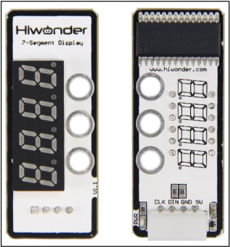
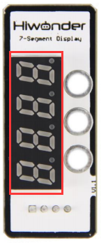

# 1. Digital Tube Module Manual

## 1.1 Digital Tube Module

### 1.1.1 Sensor Introduction

LED digital tube is a 4-digit red LED digital tube used to display numbers, decimal points and some special characters. It features a compact, user-friendly design for displaying sensor values like speed, time, score, temperature, and distance in robotics projects.

### 1.1.2 Working Principle

It has 4 digital tubes, each of which has 8 LED lights. By controlling these 8 lights, you can make a digital tube display numbers, decimal points and part of the letters.

## 1.2 Notice

1.  Do not exceed the rated voltage range during use.

2.  Handle with care during use.

## 1.3 Specifications

For more information, you may refer to "**[Digital tube sensor schematic](https://drive.google.com/drive/folders/1e4hyrV5j96fYs93Wj5IVg0-WDs9dq7Wf?usp=sharing)**"

### 1.3.1 Pin Instruction

| **Pin** | **Instruction** |
| :-----: | :-------------: |
|   5V    |   Power Input   |
|   GND   |     Ground      |
|   DIN   |   Data Input    |
|   CLK   |   Clock input   |

### 1.3.2 Specifications

<table class="docutils-nobg" border="1">
<colgroup>
<col style="width: 50%" />
<col style="width: 50%" />
</colgroup>
<tbody>
<tr>
<td colspan="2" style="text-align: center;">

<strong>Digital Tube Sensor</strong>

</td>
</tr>
<tr>
<td style="text-align: center;">

<strong>Parameter</strong>

</td>
<td style="text-align: center;">

<strong>Specification</strong>

</td>
</tr>
<tr>
<td style="text-align: center;">

<strong>Power Supply</strong>

</td>
<td style="text-align: center;">

<strong>DC 5V</strong>

</td>
</tr>
<tr>
<td style="text-align: center;">

<strong>Communication</strong>

</td>
<td style="text-align: center;">

<strong>Dual Digital Control</strong>

</td>
</tr>
<tr>
<td style="text-align: center;">

<strong>Indicator Light (PWR) Description</strong>

</td>
<td style="text-align: center;">

<strong>The PWR LED lights up when powered.</strong>

</td>
</tr>
<tr>
<td style="text-align: center;">

<strong>Connector Type</strong>

</td>
<td style="text-align: center;">

<strong>5264-4AW</strong>

</td>
</tr>
<tr>
<td style="text-align: center;">

<strong>Product Dimensions</strong>

</td>
<td style="text-align: center;">

<strong>50mmx20mm</strong>

</td>
</tr>
<tr>
<td colspan="2" style="text-align: center;">

<strong>Modular installation, compatible with Lego series.</strong>

</td>
</tr>
<tr>
<td colspan="2" style="text-align: center;">

<strong>Four red LEDs, each including a decimal point</strong>

</td>
</tr>
<tr>
<td colspan="2" style="text-align: center;">

<strong>Adjustable display brightness</strong>

</td>
</tr>
</tbody>
</table>

### 1.3.3 Project Outcome

You can refer to the case tutorials and programs for different platforms in the same directory as this tutorial. This section will demonstrate the testing effect using Arduino IDE as an example.

By using the TM1640 chip to set the LED matrix in the four digital tubes to achieve the effect of displaying numbers, decimal points and some letters.

And the final effect of the digital tube is: "**1234**" are displayed on the four-digit digital tube.