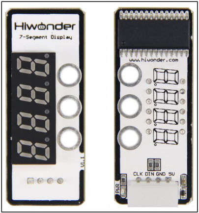
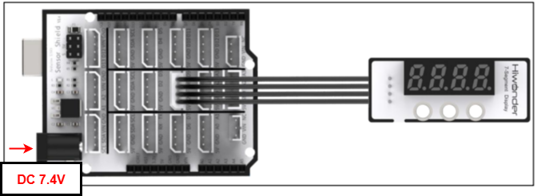
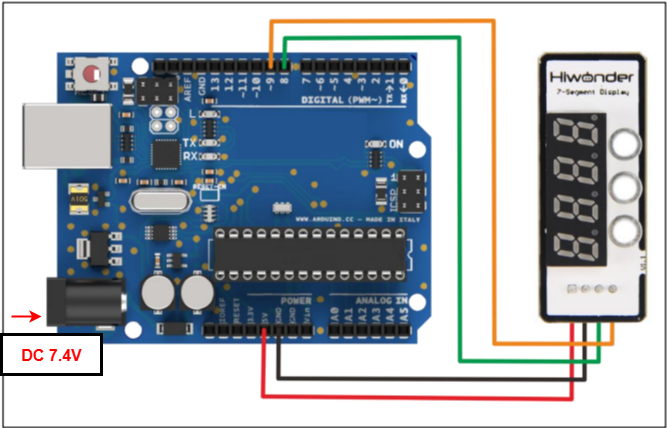

# 2. Arduino Development



## 2.1 Getting Started

### 2.1.1 Wiring Instruction

This section illustrates connecting a 4-pin cable to the A2 and A3 ports on the Arduino expansion board. Refer to the diagram below.



If you do not have an Arduino expansion board, use a Dupont wire to directly connect to the Arduino development board, just as below:



> [!NOTE]
>
> * **When using Hiwonder's lithium battery, connect the battery cable with the red wire to the positive (+) terminal and the black wire to the negative (–) terminal of the DC port.**
>
> * **If the battery is not connected to the cables, do not connect the cable ends directly together. Doing so may cause a short circuit and damage the system.**
>
> * **Before powering on, ensure that no metal objects are touching the controller. Otherwise, the exposed pins at the bottom of the board may cause a short circuit and damage the controller.**

### 2.1.2 Environment Configuration

You can install the Arduino IDE on your computer. The software package is located under **"[Appendix->Arduino Installation Package](https://drive.google.com/drive/folders/1p_CynW-uc9e1yV8mQyXurabCUKfBHimY?usp=sharing)"** For more information, please refer to the same directory.

## 2.2 Test Case

Program to display "**1234**" on the seven-segment display.

### 2.2.1 Program Download

1. Connect the Arduino UNO development board with the expansion board to the computer via a USB cable. You can open Arduino IDE, click **"File → New,"** and import the program located in the same directory as this tutorial.

2. Remember to select the correct development board and port. The ports shown below are for reference only. Then compile and upload the program.


3. After the code is uploaded successfully, click  to open the serial monitor, set the baud rate to 9600 to observe the output.

### 2.2.2 Project Outcome

The four-digit display shows the numbers **"1234."**

### 2.2.3 Program Brief Analysis

- **Import Libraries**

```c++
#include <TM1640> //Include the TM1640 library
TM1640 module(8,9); //Define sensor interface
```

Include **TM1640** library files

Search **"TM16xx LEDs and Butons"** library file in **"Project-\>Load Library-\>Manage Library"** to install it.

- **Loop Process**

```c++
void setup()

{
  char text[17]; //Store string

sprintf(text, "%s", "1234"); //Store 1234 in the string array

module.setDisplayToString(text); //output string

}
```

Store **"1234"** in the string array and print the array on the digital tube.