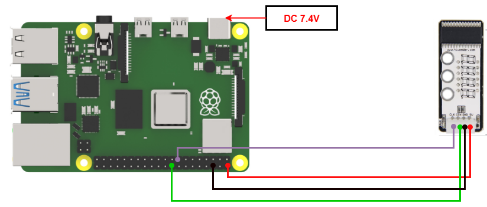

# 3. Raspberry Pi Development Tutorial


## 3.1 Getting Started

### 3.1.1 Wiring Instruction

When wiring, connect the digital tube's 5V, GND, DIN (GPIO 24), and CLK (GPIO 22) pins to the corresponding pins on the Raspberry Pi.



> [!NOTE]
>
> * **When using Hiwonder's lithium battery, connect the battery cable with the red wire to the positive (+) terminal and the black wire to the negative (–) terminal of the DC port.**
>
> * **If the battery is not connected to the cables, do not connect the cable ends directly together. Doing so may cause a short circuit and damage the system.**

### 3.1.2 Environment Configuration

Install VNC software on PC. You can find it under **"[Appendix-> Remote Desktop Connection Tool](https://drive.google.com/drive/folders/1p_CynW-uc9e1yV8mQyXurabCUKfBHimY?usp=sharing)"**. For the detailed operations of VNC, please refer to the same directory.

Drag the program and SDK library files into the Raspberry Pi system image. For demonstration, the files are placed on the Desktop in this example. 

> [!NOTE]
>
> **Make sure the library files are placed in the same directory as the program.**

Open the terminal and enter the following command to navigate to the program directory:

```bash
sudo chmod a+x Sensor_Demo/
```

## 3.2 Test Case

Program to display the number "**1234**" on the seven-segment display module.

### 3.2.1 Program Download

1. Open the terminal and enter the following command to navigate to the program directory and press Enter.

```bash
cd Desktop/Sensor_Demo/
```

2. Run the program by entering:

```bash
python3 DigitalDisplay.py
```

### 3.2.2 Project Outcome

The four-digit display shows the numbers **"1234."**

### 3.2.3 Program Brief Analysis

* **Import Libraries**

```py
import os
import sys
import time
import tm1640 as tm
```

Import the required libraries, including **system**, **delay**, and **digital tube** libraries.

Place the tm1640.py library file in the Raspberry Pi, in the same folder as the program.

- **Main Program**

```py
# Character pattern data (字模数据)
data = {'0':0x3f,'1':0x06,'2':0x5b,'3':0x4f,'4':0x66,'5':0x6d,'6':0x7d,'7':0x07,'8':0x7f,'9':0x6f}

time.sleep(2)

if __name__ == '__main__':
    
    while(1):
        tm.display_buf = (data['1'],data['2'],data['3'],data['4'])
        tm.update_display()
```

Set the font data from 0 to 9 and print "**1234**" on the digital tube.